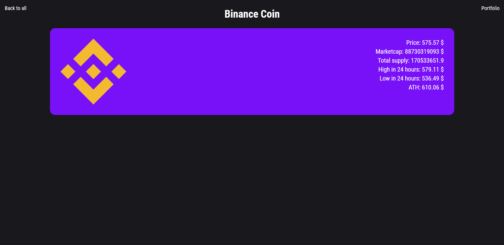
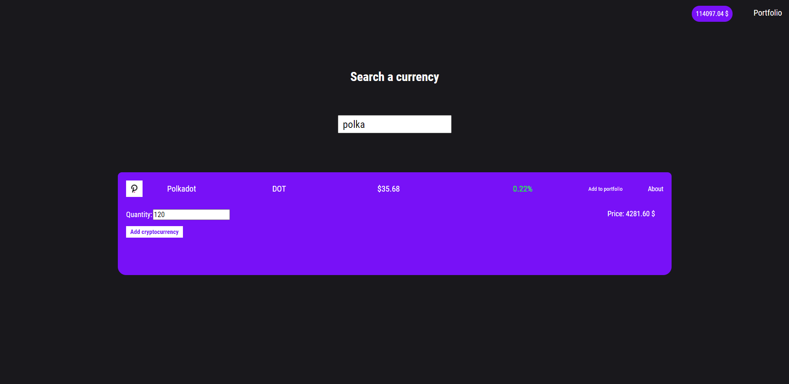
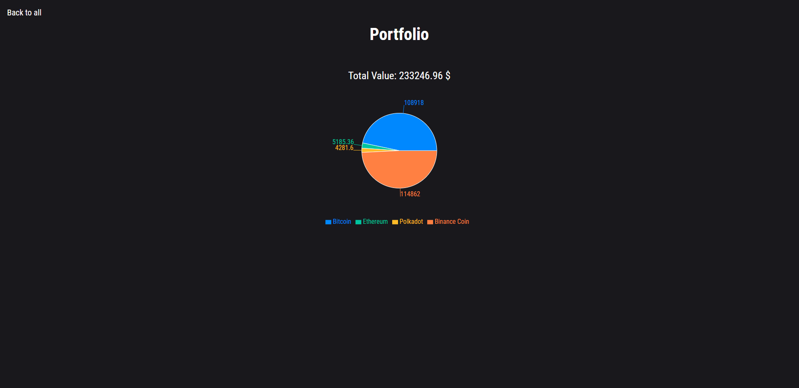

# Crypto Tracker

I used React, Styled Components and Axios libraries to write this application. This application fetch data from the Coingecko API. It presents them in the form of a table.

## Searching cryptocurrency

User can search cryptocurrency names via input.

## Detailed view

You can see the details of each cryptocurrency. You can see a lot of information on each cryptocurrency.

## Adding to portfolio

You can add each cryptocurrency to your portfolio to follow it.

## Portfolio

In your portfolio you can track the value of your currencies. The chart shows how much currency is part of your portfolio.

