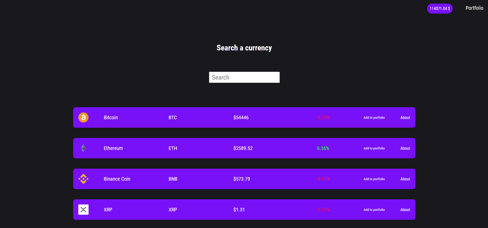

I used React, Styled Components and Axios libraries to write this application. This application retrieves data from the Coingecko API. It presents them in the form of a table. 

User can search cryptocurrency names via input. Over time, I am going to add a detailed view of the cryptocurrency.

You can see the details of each cryptocurrency.

